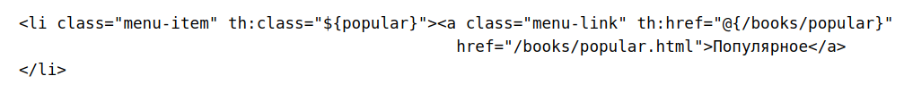
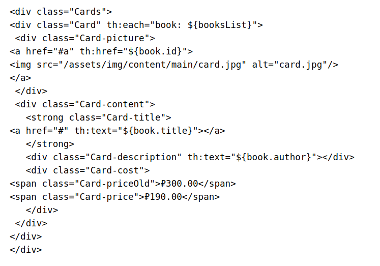
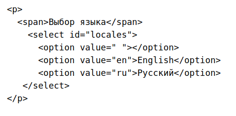

**4.7 Домашняя работа**

**Задача**

**Цель домашнего задания**

Закрепить знания, полученные в четвёртом модуле.

**Что входит в домашнее задание**

1) Подключить разделы интернет-магазина 🦾

2) Локализовать контент 🦾🦾

* **Для выполнения задания создайте копию имеющегося проекта или скачайте из bookshop. Степень сложности каждого задания показана значком** 🦾

Распакуйте архив и откройте проект MyBookShopApp. После запуска проект будет открываться по адресу http://localhost:8085/.

**Отправка домашнего задания**

Для отправки кода на проверку, используйте репозиторий java_spring на https://gitlab.skillbox.ru

**Задание 1.** 

**Подключение разделов интернет-магазина**

Что нужно сделать

В вашем распоряжении — полная вёрстка всего интернет-магазина! Однако на данный момент фронтенд все ещё как бы «зациклен» сам на себя из-за того, что в разметке используются статические адреса ресурсов, а не адреса API вашего бэкенда.

Добавьте необходимые классы контроллеров и методы-обработчики для вывода в браузере страниц, возвращаемых сервером в качестве ответов. Проверьте возможность перехода между ними.

Новинки — файл /books/recent.html

Популярное — /books/popular.html

Отложенное — /postponed.html

Авторы — /authors/index.html

Книги по жанру — /genres/index.html

Корзина — /cart.html

Войти — /signin.html

Поиск — /search/index.html

Документы — /documents/index.html

О компании — /about.html

Помощь — /faq.html

Контакты — /contacts.html

Адреса для контроллеров выберите согласно [документации на проект](https://docs.google.com/document/d/17PAwmvKpy9p5xAWfHdiTLG1T5Vv_OgY9-pNanlWKZYA/edit), например у новинок — /books/recent, у отложенного — /postponed.

**Пример реализации одного списка**

Напишем класс контроллера, метод и данные для раздела «Новинки»:

`@ModelAttribute("booksList")
public List<Book> bookList(){
return bookService.getBooksData();
}`

`@GetMapping("/books/popular")
public String recentBookPage(){
return "books/popular";
}`

[Видео 4.4 10:30](https://go.skillbox.ru/education/course/java-framework-spring/43ef52cd-d666-4e0a-8940-d6336124255c/videolesson)

Вёрстка заголовка и футера находится в файлах:

`spring-frontend/fragments/common_header_fragment.html`

`spring-frontend/fragments/common_footer_fragment.html`

Указанные ссылки ведут на HTML-страницы, то есть данные статичны. Нам же необходимо изменить ссылки таким образом чтобы они обращались к контроллерам, которые мы прописали. Например, для пункта меню «Популярное» надо добавить соответствующий атрибут th:href:

То же самое нужно сделать для всех пунктов меню в заголовке и футере.

[Видео 4.4 2:30](https://go.skillbox.ru/education/course/java-framework-spring/43ef52cd-d666-4e0a-8940-d6336124255c/videolesson)

После этого запустите проект и убедитесь, что по запросу http://localhost:8085/books/popular открывается список новинок. На этом этапе данные статичны, то есть соответствуют тем, что указаны в HTML-коде фрагмента вывода списка. Теперь добавим во фрагмент Thymeleaf

spring-frontend/fragments/books_pool_fragment.html

цикл для вывода списка книг, а шаблонные данные удалим.

Карточка одного товара будет выглядеть так:

[Видео 4.4 12:30](https://go.skillbox.ru/education/course/java-framework-spring/43ef52cd-d666-4e0a-8940-d6336124255c/videolesson)

В данном примере в каждой карточке выводится заголовок, автор книги и ID для ссылки. Дополнительно, используя условие if, нужно выводить стоимость без скидки, или добавить вывод скидки, если она есть.

В итоге у вас должны работать все ссылки на главной странице, без прямого указания на HTML. Данные для списков книг должны задаваться в контроллерах.

**Советы и рекомендации**

Используйте техническую документацию к проекту, чтобы лучше ориентироваться в его структуре.

**Что оценивается**

**Зачёт**: проект запускается, есть доступ к указанным в задании разделам и страницам, по ним возможен переход, книги выводятся на основании тех данных, что вы получили в приложении.

**На доработку**: не все условия задания выполнены.

**Как отправить задание на проверку**

Сохраните результат в виде отдельной Git-ветки, создайте Merge Request (MR) и пришлите ссылку на MR через форму для сдачи домашнего задания.

**Задание 2.** 

**Локализация контента**

**Что нужно сделать**

Локализация пользовательского интерфейса — неотъемлемая часть многих веб-проектов, особенно международных. Добавьте возможность взаимодействия с вашим проектом для пользователей, не владеющих русским языком. Возможность смены языка интерфейса вашего интернет-магазина реализуйте с помощью инструментов Thymeleaf.

Предлагается добавить выпадающий список выбора языка во фрагмент левого блока футера spring-frontend/fragments/common_footer_fragment.html. Это можно сделать, добавив в после списка иконок </ul>.

Вы можете выполнить вёрстку так, как вам больше нравится.

**Что оценивается**

**Зачёт**: проект запускается, в футере страниц есть кнопка с выпадающим списком для смены языка. После выбора языка происходит замена текстов на локализованных страницах (список страниц для локализации смотрите в задании 1).

**На доработку**: не все условия задания выполнены.

**Как отправить задание на проверку**

Сохраните результат в виде отдельной Git-ветки и пришлите ссылку на Git-репозиторий через форму для сдачи домашнего задания.

